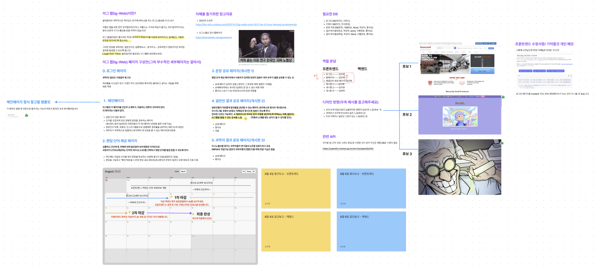
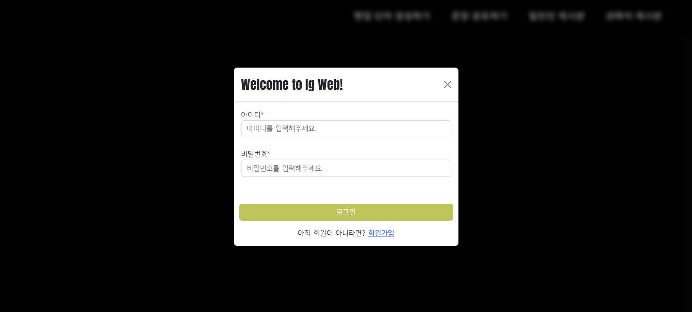
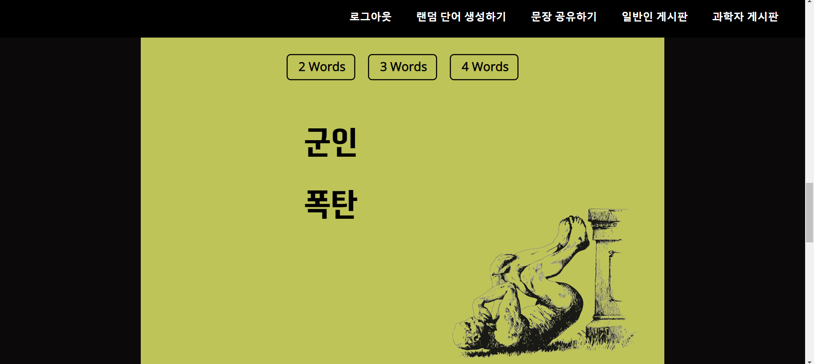
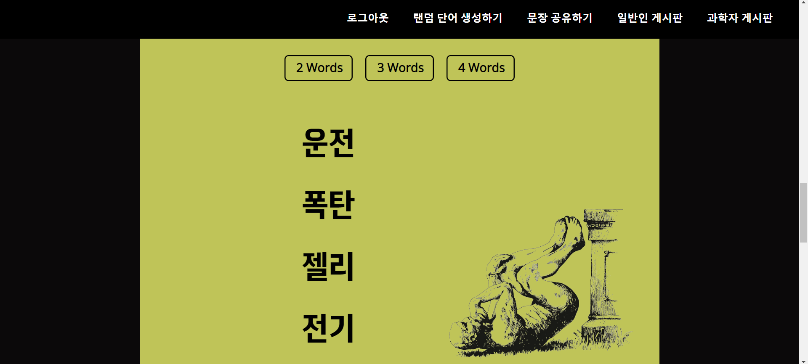
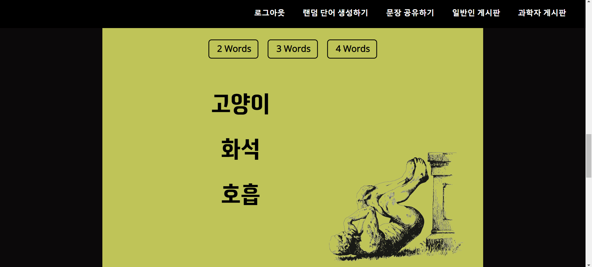
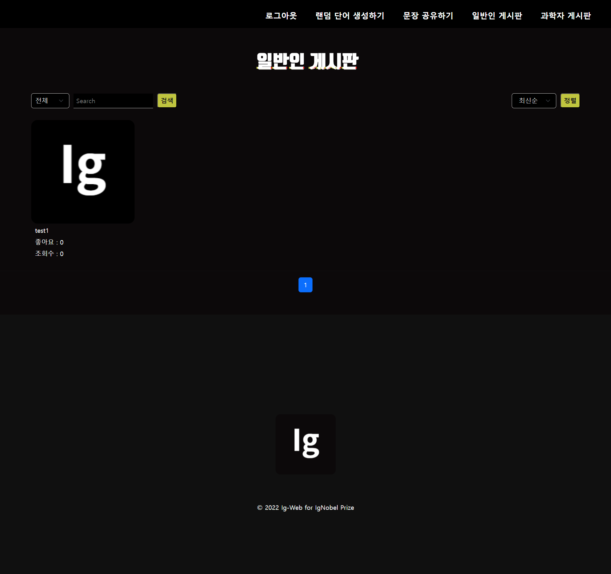
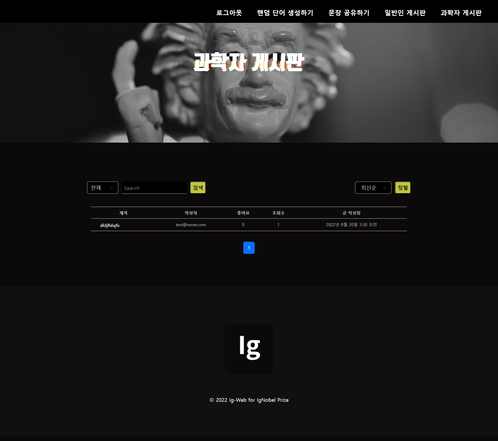
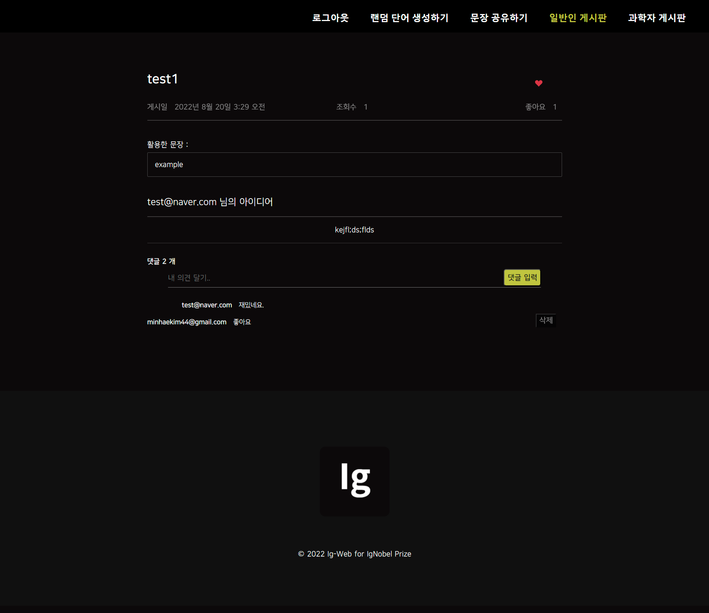

# 🧑‍🔬 IgWeb
이그노벨상을 위한 기발하고도 황당한 아이디어의 모든 것

## 💻 프로젝트 소개
이그노벨상이란, '괴짜들의 노벨상'이라는 뜻으로 있을 법 하지 않은 황당한 연구를 한 과학자에게 주는 상입니다. </br>
예를 들면 '개구리를 공중부양시키는 법'이 있겠죠! </br>
이그웹은 랜덤 단어를 조합하여 황당한 아이디어를 제시하고, 아이디어를 실행한 결과를 공유하는 플랫폼입니다. </br>
틱톡이나 유튜브 쇼츠와 연결하여 아이디어 제공에 대한 수익을 얻습니다. </br>
일반인부터 정말로 이그노벨상을 꿈꾸는 과학자들까지, 자유롭게 게시판을 통해 소통할 수 있습니다.

## 방문하기
:link: <https://port-0-igboard-g0424l70mpcr1.gksl1.cloudtype.app/>

#### :two_men_holding_hands: 팀원 
김민혜: 팀장, 프론트엔드(메인 홈 페이지, 랜덤 단어 생성 페이지, 로그인 및 회원가입 페이지)<br/>
:link: 홈페이지 코드 : <https://github.com/widoto/igboard/tree/main/igwebapp/templates><br/>
:link: 로그인/회원가입 코드 : <https://github.com/widoto/igboard/tree/main/accounts/templates><br/>
김하연: 프론트엔드(게시판 페이지, 게시판 글쓰기 페이지)<br/>
이하진: 백엔드 파트<br/>
오샘: 백엔드 파트<br/>
한재영: 백엔드 파트 <br/>
이서연: 백엔드 파트<br/>
정서린: 디자인<br/>

### :camera: View
<details>
    <summary>기획</summary>
    </img><br/>
</details>
<details>
    <summary>로그인</summary>
    </img><br/>
</details>
<details>
    <summary>회원가입</summary>
    </img><br/>
</details>
<details>
    <summary>메인홈페이지</summary>
    </img><br/>
</details>
<details>
    <summary>랜덤단어 생성 페이지</summary>
    데이터베이스에서 랜덤 단어를 뽑아옴.<br>
    * 랜덤단어 2개 생성<br/>
    </img><br/>
    * 랜덤단어 3개 생성<br/>
    </img><br/>
    * 랜덤단어 4개 생성<br/>
    </img><br/>
    
</details>
<details>
    <summary>일반인 게시판</summary>
    유튜브 쇼츠, 틱톡 영상, 핀터레스트와 같은 배치로 구성함.<br>
    </img><br/>
</details>
<details>
    <summary>과학자 게시판</summary>
    포멀한 형식의 게시판을 구성함.<br>
    </img><br/>
</details>
<details>
    <summary>글쓰기 페이지</summary>
    </img><br/>
</details>

# 실행방법

1. 가상환경 만들기
    
    `python -m venv 가상환경이름`
    
2. 가상환경 실행하기
    
    `source 가상환경이름/bin/activate`
    
3. 가상환경에 설치
    
    `pip install django`
    
    `pip install django-summernote`
    
    `pip install mysqlclient`
    
    `pip install pillow`
    
    설치 목록 생성 확인
    
    `pip freeze`
    
4. 서버 시작
    
    `python manage.py runserver`

## Django-api Document

### 게시판
#### 게시글
1.board_list
- 요청방식 : get
- 기능 : 전체(과학자 + 일반인) 게시글 목록 보여줌 (제목, 작성자, 글 작성일)
- url : /board
```
{ 
    "title":"제목" ,
    "writer": "작성자",
    "write_dttm": "작성날짜",
 }
```
2. file_download
- 요청방식 : GET
- 기능 : 누르면 파일 다운로드
url : /board/public/download?path={{ board.file }}
- board.file : 파일 이름

#### 댓글
1. comments_create
- 요청방식 : POST
- 기능 : 댓글 생성
- url : /board/ public/detail/board_n/comments/
- board_n : 게시판 번호
```
{
    "content" : "댓글내용"
    "board" : "게시판 번호"
    "user" : "작성자"
    "create_at" : "작성날짜"
}
```
2. comments_delete
- 요청방식 : POST
- 기능 : 댓글 삭제
- url : /board/board_n/comments/comment_n/delete/
- board_n : 게시판 번호, comment_n : 댓글 번호
